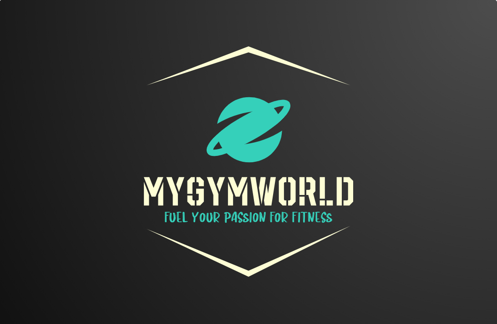

<!--
Hey, thanks for using the awesome-readme-template template.  
If you have any enhancements, then fork this project and create a pull request 
or just open an issue with the label "enhancement".

Don't forget to give this project a star for additional support ;)
Maybe you can mention me or this repo in the acknowledgements too
-->
<div align="center">
  
  <h1>My Gym World</h1>
  
  <p>
    Fuel your passion for fitness!
  </p>
  <h4>
    NOTE: You MUST provide your own APIKeys and AppSecrets for SendGrid and Cloudinary.
  </h4> 
  <p>
    For further info review [Environment Variables] in Table of Contents.
  </p>
   <h4>
    NOTE: You MUST add appsettings.json, appsettings.Development.json and apsettings.Production.json files.
  </h4>
  <p>
    The structures of these files are given in [Getting Started] in Table of Contents.
  </p>
  
<!-- Badges -->
<p>
  <a href="https://github.com/GeorgiKostadinovPro/MyGymWorld/graphs/contributors">
    
  </a>
  <a href="">
    
  </a>
  <a href="https://github.com/Louis3797/awesome-readme-template/network/members">
    
  </a>
  <a href="https://github.com/GeorgiKostadinovPro/MyGymWorld/stargazers">
  
  </a>
  <a href="https://github.com/GeorgiKostadinovPro/MyGymWorld/issues/">
    
  </a>
  <a href="https://github.com/GeorgiKostadinovPro/MyGymWorld/blob/master/LICENSE.txt">
    
  </a>
</p>
   
<h4>
    <a href="https://github.com/GeorgiKostadinovPro/MyGymWorld">Documentation</a>
  <span> · </span>
    <a href="https://github.com/GeorgiKostadinovPro/MyGymWorld/issues/">Report Bug</a>
  <span> · </span>
    <a href="https://github.com/GeorgiKostadinovPro/MyGymWorld/issues/">Request Feature</a>
  </h4>
</div>

<br />

<!-- Table of Contents -->
# :notebook_with_decorative_cover: Table of Contents

- [About the Project](#star2-about-the-project)
  * [Tech Stack](#space_invader-tech-stack)
  * [Features](#dart-features)
  * [Screenshots](#camera-screenshots)
  * [Color Reference](#art-color-reference)
  * [Environment Variables](#key-environment-variables)
- [Getting Started](#toolbox-getting-started)
  * [Run Locally](#running-run-locally)
- [Usage](#eyes-usage)
- [Roadmap](#compass-roadmap)
- [Contributing](#wave-contributing)
  * [Code of Conduct](#scroll-code-of-conduct)
- [FAQ](#grey_question-faq)
- [License](#warning-license)
- [Contact](#handshake-contact)
- [Acknowledgements](#gem-acknowledgements)

  

<!-- About the Project -->
## :star2: About the Project

<!-- TechStack -->
### :space_invader: Tech Stack
<details>
  <summary>Server</summary>
  <ul>
    <li><a href="https://learn.microsoft.com/en-us/aspnet/core/release-notes/aspnetcore-6.0?view=aspnetcore-6.0">ASP.NET Core 6.0</a></li>
    <li><a href="https://learn.microsoft.com/en-us/aspnet/core/tutorials/first-mvc-app/start-mvc?view=aspnetcore-6.0&tabs=visual-studio">ASP.NET Core MVC (.NET 6.0)</a></li>
    <li><a href="https://learn.microsoft.com/en-us/aspnet/core/mvc/controllers/areas?view=aspnetcore-6.0">ASP.NET Core Areas</a></li>
    <li><a href="https://learn.microsoft.com/en-us/ef/core/">Entity Framework Core 6.0</a></li>
    <li><a href="https://automapper.org/">AutoMapper</a></li>
    <li><a href="https://getbootstrap.com/">Bootstrap</a></li>
    <li><a href="https://jquery.com/">jQuery</a></li>
    <li><a href="https://sendgrid.com/">SendGrid</a></li>
    <li><a href="https://cloudinary.com/">Cloudinary</a></li>
    <li><a href="https://www.tiny.cloud/">TinyMCE (WYSIWYG HTML editor)</a></li>
    <li><a href="https://github.com/CodeSeven/toastr">Toastr (non-blocking notifications)</a></li>
    <li><a href="https://github.com/drygiel/csslider">CSS Slider (Pure CSS, simple slider)</a></li>
    <li><a href="https://owlcarousel2.github.io/OwlCarousel2/">Owl Carousel 2</a></li>
    <li><a href="https://www.cssscript.com/animated-particles-background-pure-javascript/">Animated Particles Background With Pure JavaScript (By Nash Vail)</a></li>
    <li><a href="https://codepen.io/choogoor/pen/RwBKZey">CARD HOVER WITH :HAS() (By Aleksandar Čugurović)</a></li>
    <li><a href="https://fonts.google.com/icons">Material Fonts and Icons (Google Fonts)</a></li>
    <li><a href="https://www.w3schools.com/icons/fontawesome_icons_intro.asp">FontAwesome</a></li>
    <li><a href="https://feathericons.com/">Feather</a></li>
  </ul>
</details>

<details>
<summary>Database</summary>
  <ul>
    <li><a href="https://www.microsoft.com/en-us/sql-server/sql-server-downloads">MSSQL Server</a></li>
    <li><a href="https://learn.microsoft.com/en-us/sql/t-sql/language-reference?view=sql-server-ver16">T-SQL (Transact-SQL)</a></li>
    <li><a href="https://sqldbm.com/Home/">SqlDBM (SQL Database Modeler)</a></li>
  </ul>
</details>

<details>
<summary>DevOps</summary>
  <ul>
    <li><a href="https://www.atlassian.com/software/jira/features/scrum-boards">Jira Scrum Boards</a></li>
  </ul>
</details>

<!-- Features -->
### :dart: Features
There are two Areas in the project (Manager and Admin) and Common Layer for Authenticated Users.
<details>
  <summary>Custom Authentication Flow</summary>
  <ul>
    <li>Register.</li>
    <li>Login.</li>
    <li>Remember me.</li>
    <li>Send Email for Reset Forgot Password.</li>
    <li>Reset Password.</li>
  </ul>
</details>

<details>
  <summary>Guest</summary>
  <ul>
    <li>Only has access to Home Page.</li>
  </ul>
</details>
<details>
  <summary>Authenticated User</summary>
  <ul>
    <li>Can reset his password.</li>
    <li>Can view his profile.</li>
    <li>Can edit his profile.</li>
    <li>Can upload profile picture.</li>
    <li>Can delete profile picture.</li>
    <li>Can use the given pagination on every page.</li>
    <li>Can review his notifications.</li>
    <li>Can delete his notifications.</li>
    <li>Can mark notification as read.</li>
    <li>Can see all gyms.</li>
    <li>Can sort all gyms.</li>
    <li>Can filter all gyms.</li>
    <li>Can search all gyms.</li>
    <li>Can see details for each gym.</li>
    <li>Can like a gym.</li>
    <li>Can dislike a gym.</li>
    <li>Can see all comments about a gym.</li>
    <li>Can comment on gym.</li>
    <li>Can reply to comment on gym.</li>
    <li>Can join a gym.</li>
    <li>Can leave a gym.</li>
    <li>Can see all events for gym after joining it.</li>
    <li>Can see details about each event.</li>
    <li>Can join events.</li>
    <li>Can leave events.</li>
    <li><strong>CANNOT</strong> join already ended events.</li>
    <li><strong>CANNOT</strong> leave already ended events.</li>
    <li>Can see all his joined events (search, filter and sort them).</li>
    <li>Can see all articles about a gym.</li>
    <li>Can see details about each article.</li>
    <li>Can see all membership for each gym.</li>
    <li>Can see details about each membership.</li>
    <li>Can by a membership.</li>
    <li>Can become manager via request to Admin.</li>
  </ul>
</details>

<details>
  <summary>Manager</summary>
  <ul>
    <li>Can use <strong>Authenticated User</strong> functionality.</li>
    <li><strong>CANNOT</strong> join his own gyms.</li>
    <li><strong>CANNOT</strong> leave his own gyms.</li>
    <li>Can see all his <strong>active</strong> created gyms.</li>
    <li>Can see all his <strong>deleted</strong> created gyms.</li>
    <li>Can create a gym.</li>
    <li>Can edit a gym.</li>
    <li>Can delete a gym.</li>
    <li>Can create events for a gym.</li>
    <li>Can edit events for a gym.</li>
    <li>Can delete events for a gym.</li>
    <li><strong>CANNOT</strong> delete already running events.</li>
    <li><strong>CANNOT</strong> join his own events</li>
    <li><strong>CANNOT</strong> leave his own events</li>
    <li>Can create articles for a gym.</li>
    <li>Can edit articles for a gym.</li>
    <li>Can delete articles for a gym.</li>
    <li>Can create memberships for a gym.</li>
    <li>Can edit memberships for a gym.</li>
    <li>Can delete delete for a gym.</li>
  </ul>
</details>

<details>
  <summary>Administrator</summary>
  <ul>
    <li>Can use <strong>Authenticated User</strong> functionality.</li>
    <li>Can see all <strong>active</strong> users in the app.</li>
    <li>Can see all <strong>deleted</strong> users in the app.</li>
    <li>Can delete a user.</li>
    <li>Can see all manager requests.</li>
    <li>Can see details about a manager request.</li>
    <li>Can approve a manager request.</li>
    <li>Can reject a manager request.</li>
    <li>Can approve a rejected manager.</li>
    <li>Can reject an approved manager. </li>
    <li>Can see all <strong>active</strong> the roles in the app.</li>
    <li>Can see all <strong>deleted</strong> the roles in the app.</li>
    <li>Can create a role.</li>
    <li>Can edit a role.</li>
    <li>Can delete a role.</li>
    <li>Can see all <strong>active</strong> gyms in the app with their manager.</li>
    <li>Can see all <strong>deleted</strong> gyms in the app with their manager.</li>
  </ul>
</details>

<!-- Screenshots -->
### :camera: Screenshots

<div align="center"> 
  
</div>

<!-- Color Reference -->
### :art: Color Reference

| Color             | Hex                                                                |
| ----------------- | ------------------------------------------------------------------ |
| Primary Color |  #222831 |
| Secondary Color |  #393E46 |
| Accent Color |  #00ADB5 |
| Text Color |  #EEEEEE |


<!-- Env Variables -->
### :key: Environment Variables

<p>To run this project, you will need to add the following variables to your appsettings.Development.json and appsettings.Production.json.</p>
<p>The whole structure of these files is describe in <strong>Getting Started</strong> section below.</p>

<p>You need to add these lines of json to your appsettings.json files:</p>
<strong>NOTE: You need to provide your own APIKeys and APISecrets.</strong>

```json
{
"SendGrid": {
    "APIKey": "",
    "Email": "",
    "Name": ""
  },
  "Cloudinary": {
    "CloudName": "",
    "APIKey": "",
    "APISecret": ""
  },
}
```

<!-- Getting Started -->
## 	:toolbox: Getting Started

<!-- Run Locally -->
### :running: Run Locally

Clone the project

```bash
  git clone https://github.com/Louis3797/awesome-readme-template.git
```

Go to the project directory

```bash
  cd my-project
```

Install dependencies

```bash
  yarn install
```

Start the server

```bash
  yarn start
```

<!-- Usage -->
## :eyes: Usage

Use this space to tell a little more about your project and how it can be used. Show additional screenshots, code samples, demos or link to other resources.


```javascript
import Component from 'my-project'

function App() {
  return <Component />
}
```

<!-- Roadmap -->
## :compass: Roadmap

* [x] Todo 1
* [ ] Todo 2


<!-- Contributing -->
## :wave: Contributing

<a href="https://github.com/Louis3797/awesome-readme-template/graphs/contributors">
  
</a>


Contributions are always welcome!

See `contributing.md` for ways to get started.


<!-- Code of Conduct -->
### :scroll: Code of Conduct

Please read the [Code of Conduct](https://github.com/Louis3797/awesome-readme-template/blob/master/CODE_OF_CONDUCT.md)

<!-- FAQ -->
## :grey_question: FAQ

- Question 1

  + Answer 1

- Question 2

  + Answer 2


<!-- License -->
## :warning: License

Distributed under the MIT license. See LICENSE.txt for more information.


<!-- Contact -->
## :handshake: Contact

Your Name - [LinkedIn](https://www.linkedin.com/in/georgi-kostadinov-125349241) - kostadinovgeorgi16@gmail.com - georgi.kostadinov14@abv.bg

Project Link: [MyGymWorld](https://github.com/GeorgiKostadinovPro/MyGymWorld)


<!-- Acknowledgments -->
## :gem: Acknowledgements

My useful resources and libraries that I used to create this readme file.

 - [Shields.io](https://shields.io/)
 - [Awesome README](https://github.com/matiassingers/awesome-readme)
 - [Emoji Cheat Sheet](https://github.com/ikatyang/emoji-cheat-sheet/blob/master/README.md#travel--places)
 - [Readme Template](https://github.com/othneildrew/Best-README-Template)
 - [Louis3797 Readme Template](https://github.com/Louis3797/awesome-readme-template).
