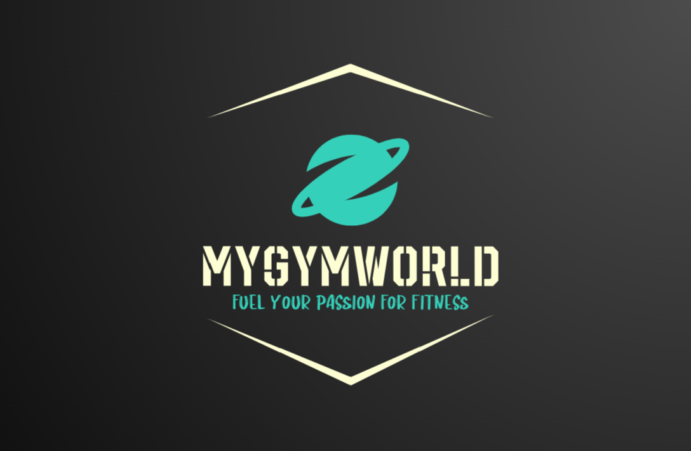

<!--
Hey, thanks for using the awesome-readme-template template.  
If you have any enhancements, then fork this project and create a pull request 
or just open an issue with the label "enhancement".

Don't forget to give this project a star for additional support ;)
Maybe you can mention me or this repo in the acknowledgements too
-->
<div align="center">
  
  <h1>My Gym World</h1>
  
  <p>
    Fuel your passion for fitness!
  </p>
  <h4>
    NOTE: You MUST provide your own APIKeys and AppSecrets for SendGrid, Cloudinary and Stripe.
  </h4> 
  <h4>
    NOTE: You need to change the ApplicationUrl in secrets.json for SendGrid, Cloudinary and Stripe to work.
  </h4>
  <p>
    For further info review <strong>[Environment Variables]</strong> and <strong>[Getting Started]</strong> in Table of Contents.
  </p>
  
<!-- Badges -->
<p>
  <a href="https://github.com/GeorgiKostadinovPro/MyGymWorld/graphs/contributors">
    
  </a>
  <a href="">
    
  </a>
  <a href="https://github.com/Louis3797/awesome-readme-template/network/members">
    
  </a>
  <a href="https://github.com/GeorgiKostadinovPro/MyGymWorld/stargazers">
  
  </a>
  <a href="https://github.com/GeorgiKostadinovPro/MyGymWorld/issues/">
    
  </a>
  <a href="https://github.com/GeorgiKostadinovPro/MyGymWorld/blob/master/LICENSE.txt">
    
  </a>
</p>
   
<h4>
    <a href="https://github.com/GeorgiKostadinovPro/MyGymWorld">Documentation</a>
  <span> · </span>
    <a href="https://github.com/GeorgiKostadinovPro/MyGymWorld/issues/">Report Bug</a>
  <span> · </span>
    <a href="https://github.com/GeorgiKostadinovPro/MyGymWorld/issues/">Request Feature</a>
  </h4>
</div>

<br />

<!-- Table of Contents -->
# :notebook_with_decorative_cover: Table of Contents

- [About the Project](#star2-about-the-project)
  * [Tech Stack](#space_invader-tech-stack)
  * [Features](#dart-features)
  * [Screenshots](#camera-screenshots)
  * [Seeding](#seeding)
  * [Unit Tests](#unit-tests)
  * [Color Reference](#art-color-reference)
  * [Environment Variables](#key-environment-variables)
- [Getting Started](#toolbox-getting-started)
  * [Run Locally](#running-run-locally)
- [Usage](#eyes-usage)
- [Roadmap](#compass-roadmap)
- [License](#warning-license)
- [Contact](#handshake-contact)
- [Acknowledgements](#gem-acknowledgements)

<!-- About the Project -->
## :star2: About the Project
<p>MyGymWorld is an easy to use platform where fitness enthusiasts can find the perfect gym for them.</p>
<p>User can easily become manager after getting approval from the site admin. After that he can create a gym and keep track of all gyms he have created.</p>
<p>Users can search, filter, sort gyms - like and dislike a gym, post comments, join gyms communities.</p>
<p>Moreover, after joining a gym, users can review events for the gym, and decide to join or leave an event.</p>
<p>After joining a gym users can now read the gym published articles, and can even subscribe for articles (receive notification for every new article that gets published).</p>
<p>After subscribing he can always unsubscribe and stop receiving notifications.</p>
<p>One more thing is that gym members can review memberships and buy cards for that gym directly from the platform (weekly, monthly or yearly membership).</p>
<p>After paying for a card each user receives a QR Code card and now he can easily go in the gym and exercise.</p>
<p>Users can see the memberships they payed for through "My Memberships" page.</p>
<p>Users can easily keep track of their payments for memberships throught "My Payments" page.</p>
<p>When a membership expires he can easily buy a new one.</p>
<p>Gym managers can easily keep track of their gyms and payments throught their Manager Panel.</p>
<p>For more information review the <strong>Features</strong> section below.</p>

<!-- TechStack -->
### :space_invader: Tech Stack
<details>
  <summary>Server</summary>
  <ul>
    <li><a href="https://learn.microsoft.com/en-us/aspnet/core/release-notes/aspnetcore-6.0?view=aspnetcore-6.0">ASP.NET Core 6.0</a></li>
    <li><a href="https://learn.microsoft.com/en-us/aspnet/core/mvc/controllers/areas?view=aspnetcore-6.0">ASP.NET Core Areas</a></li>
    <li><a href="https://learn.microsoft.com/en-us/ef/core/">Entity Framework Core 6.0</a></li>
    <li><a href="https://automapper.org/">AutoMapper</a></li>
    <li><a href="https://getbootstrap.com/">Bootstrap</a></li>
    <li><a href="https://jquery.com/">jQuery</a></li>
    <li><a href="https://nunit.org/">NUnit</a></li>
    <li><a href="https://www.nuget.org/packages/Moq">Moq</a></li>
    <li><a href="https://sendgrid.com/">SendGrid</a></li>
    <li><a href="https://cloudinary.com/">Cloudinary</a></li>
    <li><a href="https://stripe.com/en-bg">Stripe (Payment Gateway)</a></li>
    <li><a href="https://github.com/codebude/QRCoder">QRCoder (QR Code generator library)</a></li>
    <li><a href="https://www.tiny.cloud/">TinyMCE (WYSIWYG HTML editor)</a></li>
    <li><a href="https://github.com/CodeSeven/toastr">Toastr (non-blocking notifications)</a></li>
    <li><a href="https://fonts.google.com/icons">Material Fonts and Icons (Google Fonts)</a></li>
    <li><a href="https://www.w3schools.com/icons/fontawesome_icons_intro.asp">FontAwesome</a></li>
  </ul>
</details>

<details>
<summary>Database</summary>
  <ul>
    <li><a href="https://www.microsoft.com/en-us/sql-server/sql-server-downloads">MSSQL Server</a></li>
    <li><a href="https://learn.microsoft.com/en-us/sql/t-sql/language-reference?view=sql-server-ver16">T-SQL (Transact-SQL)</a></li>
    <li><a href="https://sqldbm.com/Home/">SqlDBM (SQL Database Modeler)</a></li>
  </ul>
</details>

<details>
<summary>DevOps</summary>
  <ul>
    <li><a href="https://www.atlassian.com/software/jira/features/scrum-boards">Jira Scrum Boards</a></li>
  </ul>
</details>

<!-- Features -->
### :dart: Features
There are two Areas in the project (Manager and Admin) and Common Layer for Authenticated Users.
<details>
  <summary>Custom Authentication Flow</summary>
  <ul>
    <li>Register.</li>
    <li>Login.</li>
    <li>Remember me.</li>
    <li>Send Email for Reset Forgot Password.</li>
    <li>Reset Password.</li>
  </ul>
</details>

<details>
  <summary>Guest</summary>
  <ul>
    <li>Only has access to Home Page.</li>
  </ul>
</details>
<details>
  <summary>Authenticated User</summary>
  <ul>
    <li>Can reset his password.</li>
    <li>Can see the Contact form and ask questions.</li>
    <li>Can view his profile.</li>
    <li>Can edit his profile.</li>
    <li>Can upload profile picture.</li>
    <li>Can delete profile picture.</li>
    <li>Can use the given pagination on every page.</li>
    <li>Can recieve notifications.</li>
    <li>Can review his notifications.</li>
    <li>Can delete notification.</li>
    <li>Can delete all notifications at once.</li>
    <li>Can mark notification as read.</li>
    <li>Can mark all notifications as read at once.</li>
    <li>Can see all gyms.</li>
    <li>Can sort all gyms.</li>
    <li>Can filter all gyms.</li>
    <li>Can search all gyms.</li>
    <li>Can see details for each gym.</li>
    <li>Can like a gym.</li>
    <li>Can dislike a gym.</li>
    <li>Can see all comments about a gym.</li>
    <li>Can comment on gym.</li>
    <li>Can reply to comment on gym.</li>
    <li>Can join a gym.</li>
    <li>Can leave a gym.</li>
    <li>Can see all events for gym after joining it. (filter, sort and search)</li>
    <li>Can see details about each event.</li>
    <li>Can join events.</li>
    <li>Can leave events.</li>
    <li><strong>CANNOT</strong> join already ended events.</li>
    <li><strong>CANNOT</strong> leave already ended events.</li>
    <li>Can see all his joined events (search, filter and sort them).</li>
    <li>Can see all articles about a gym after joining it. (filter, sort and search)</li>
    <li>Can read each article.</li>
    <li>Can subscribe for gym articles.</li>
    <li>Can receive notifications to his notifications page for every newly created article and read it.</li>
    <li>Can receive articles notifications via email after subscribing.</li>
    <li>Can unsubscribe for gym articles. (stop receiving articles notifications)</li>
    <li>Can remove article from his articles collection.</li>
    <li>Can see all membership for each gym after joining it. (filter, sort and search)</li>
    <li>Can see details about each membership.</li>
    <li>Can buy a membership.</li>
    <li>Can see all memberships he payed for. (Each has a unqiue QR Code)</li>
    <li>Can see details for his payment.</li>
    <li>Can keep track of all his payments for gym memberships.</li>
    <li>Can become manager via request to Admin.</li>
    <li>If the user gets rejected by the admin he <strong>CANNOT</strong> apply again.</li>
  </ul>
</details>

<details>
  <summary>Manager</summary>
  <ul>
    <li>Can use <strong>Authenticated User</strong> functionality.</li>
    <li><strong>CANNOT</strong> join his own gyms.</li>
    <li><strong>CANNOT</strong> leave his own gyms.</li>
    <li>Can see all his <strong>active</strong> created gyms.</li>
    <li>Can see all his <strong>deleted</strong> created gyms.</li>
    <li>Can create a gym.</li>
    <li>Can edit a gym.</li>
    <li>Can delete a gym.</li>
    <li>Can create events for a gym.</li>
    <li>Can edit events for a gym.</li>
    <li>Can delete events for a gym. (only <strong>ended</strong> events)</li>
    <li><strong>CANNOT</strong> join his own events</li>
    <li><strong>CANNOT</strong> leave his own events</li>
    <li>Can create articles for a gym.</li>
    <li>Can edit articles for a gym.</li>
    <li>Can delete articles for a gym.</li>
    <li>Can create memberships for a gym.</li>
    <li>Can edit memberships for a gym.</li>
    <li>Can delete memberships for a gym.</li>
    <li>Can keep track of all payments through his Manager Panel.</li>
  </ul>
</details>

<details>
  <summary>Administrator</summary>
  <ul>
    <li>Can use <strong>Authenticated User</strong> functionality.</li>
    <li>Can see all <strong>active</strong> users in the app.</li>
    <li>Can see all <strong>deleted</strong> users in the app.</li>
    <li>Can delete a user. (If the user is a Manager his gyms will be deleted as well)</li>
    <li>Can see all manager requests.</li>
    <li>Can see details about a manager request.</li>
    <li>Can approve a manager request.</li>
    <li>Can reject a manager request.</li>
    <li>Can approve a rejected manager.</li>
    <li>Can reject an approved manager. </li>
    <li>Can see all <strong>active</strong> the roles in the app.</li>
    <li>Can see all <strong>deleted</strong> the roles in the app.</li>
    <li>Can create a role.</li>
    <li>Can edit a role.</li>
    <li>Can delete a role.</li>
    <li>Can see all <strong>active</strong> gyms in the app with their manager.</li>
    <li>Can see all <strong>deleted</strong> gyms in the app with their manager.</li>
    <li>Can create category for gym articles.</li>
    <li>Can edit category for gym articles.</li>
    <li>Can delete category for gym articles. (all gym articles with this category will be deleted as well)</li>
  </ul>
</details>

<!-- Screenshots -->
### :camera: Screenshots

<h2>Database</h2>


<h2>Authentication flow</h2>
<h3>Register Page</h3>


<h3>Login Page</h3>


<h3>Forgot Password Page</h3>


<h3>Reset Password Page</h3>


<h3>Contact Page</h3>


<h3>Home Page Top Part (Not Authenticated User)</h3>


<h3>Home Page Bottom Part (The Same For All Users)</h3>


<h3>Home Page Top Part (Authenticated User)</h3>


<h3>Home Page Top Part (Manager)</h3>


<h3>Home Page Top Part (Administrator)</h3>


<h3>Notifications Page</h3>


<h3>User Profile Page</h3>


<h3>User Profile With Profile Picture</h3>


<h3>Edit User Profile Page</h3>


<h3>Become Manager Page</h3>


<h3>Admin Dashboard</h3>


<h3>Manager Request Details Page (For Admin)</h3>


<h3>Manager Roles Page (For Admin)</h3>


<h3>Manage Users Page (For Admin)</h3>


<h3>Manage Gyms Page (For Admin)</h3>


<h3>All Gyms Filter Page</h3>


<h3>Gym Details Page (Not Joined)</h3>


<h3>Gym Details Page (Joined)</h3>


<h3>Gym Details Page (For Manager)</h3>


<h3>Comments Page</h3>


<h3>User Joined Gyms Page</h3>


<h3>Gym Events Page</h3>


<h3>Event Details Page (Not Participated)</h3>


<h3>Gym Event Details Page (Participated)</h3>


<h3>Gym Event Details Page (For Manager)</h3>


<h3>User Joined Events Page</h3>


<h3>Gym Articles Page (Not Subscribed)</h3>


<h3>Gym Articles Page (Subscribed)</h3>


<h3>Gym Article Details Page</h3>


<h3>Gym Articles Details Page (For Manager)</h3>


<h3>Gym Memberships Page</h3>


<h3>Gym Memberships Details Page</h3>


<h3>Gym Membership Details Page (For Manager)</h3>


<h3>Buy Membership Checkout Page</h3>


<h3>Successful Payment Page</h3>


<h3>Manage My Payments Page</h3>


<h3>My Memberships Page</h3>


<h3>Create Gym Page (For Manager)</h3>


<h3>Edit Gym Page (For Manager)</h3>


<h3>Manage Gyms Page (For Manager)</h3>


<h3>Create Event Page (For Manager)</h3>


<h3>Edit Event Page (For Manager)</h3>


<h3>Create Article Page (For Manager)</h3>


<h3>Edit Article Page (For Manager)</h3>


<h3>Create Membership Page (For Manager)</h3>


<h3>Edit Membership Page (For Manager)</h3>


<h3>Manage Gym Payments Page (For Manager)</h3>


<hr />

<!-- Seeding -->
### Seeding
<p>You can review the seeded data <a href="https://github.com/GeorgiKostadinovPro/MyGymWorld/tree/master/MyGymWorld.Data/Seeding">here</a>.</p>

<strong>Seeded Data</strong>

<details>
   <summary>Users - all already authenticated (their emails are confirmed)</summary>
   <ul>
     <li>Admin - with real gmail to test the authentication flow - forgot and reset password. (the password of the account is the password for the gmail)</li>
     <li>Manager</li>
     <li>Regular User</li>
   </ul>
</details>

<details>
   <summary>Common Entities</summary>
    <ul>
     <li>Coutries</li>
     <li>Towns</li>
     <li>Addresses (1 address)</li>
     <li>Categories</li>
   </ul>
</details>

<details>
  <summary>Gym Entities</summary>
  <ul>
     <li>Gyms (Tech Gym is the most populated one)</li>
     <li>Gym Images (images may repeat themselves)</li>
     <li>Gym Events</li>
     <li>Gym Articles</li>
     <li>Gym Memberships</li>
    <li>Likes</li>
    <li>Dislikes</li>
    <li>Comments</li>
   </ul>
</details>

<hr />

<!-- Unit tests -->
### Unit Tests
<p>The technologies that were used for the unit testing are:</p>
<ul>
  <li><a href="https://nunit.org/">NUnit</a></li>
  <li><a href="https://www.nuget.org/packages/Moq">Moq</a></li>
  <li><a href="https://learn.microsoft.com/en-us/ef/core/providers/in-memory/?tabs=dotnet-core-cli">InMemory Database</a></li>
</ul>
<p>The business layer of the application <a href="https://github.com/GeorgiKostadinovPro/MyGymWorld/tree/master/MyGymWorld.Core">MyGymWorld.Core</a> is covered at 70%.</p>


<p>You can check all unit tests by going to <a href="https://github.com/GeorgiKostadinovPro/MyGymWorld/tree/master/MyGymWorld.Core.Tests">MyGymWorld.Core.Tests</a>.</p>
<p>Here is an example of test taken from <a href=https://github.com/GeorgiKostadinovPro/MyGymWorld/blob/master/MyGymWorld.Core.Tests/MembershipServiceTests.cs">MembershipServiceTests</a> :</p>

```cs
private MyGymWorldDbContext dbContext;

private IMapper mapper;
private Mock<IRepository> mockRepository;

private Mock<IQRCoderService> qrCodeServiceMock;

[SetUp]
public async Task Setup()
{
    this.mapper = InitializeAutoMapper.CreateMapper();

    this.mockRepository = new Mock<IRepository>();

    this.qrCodeServiceMock = new Mock<IQRCoderService>();

    this.dbContext = await InitializeInMemoryDatabase.CreateInMemoryDatabase();
}
```

```cs
[Test]
public async Task BuyMembershipAsyncShouldAddMembershipToUserWhenHeBuysItForTheFirstTime()
{
    var membershipId = "832fe39a-bc5b-4ea4-b0c5-68b2da06768e";
    var userId = "932fe39a-bc5b-4ea4-b0c5-68b2da06768e";

    await this.dbContext.Memberships.AddRangeAsync(new HashSet<Membership>
    {
        new Membership
        {
            Id = Guid.Parse(membershipId),
            GymId = Guid.NewGuid(),
            Price = 10m,
            MembershipType = MembershipType.Week,
            IsDeleted = false
        },
        new Membership
        {
            Id = Guid.NewGuid(),
            GymId = Guid.NewGuid(),
            Price = 10m,
            MembershipType = MembershipType.Month,
            IsDeleted = false
        },
        new Membership
        {
            Id = Guid.NewGuid(),
            IsDeleted = true
        }
    });

    await this.dbContext.SaveChangesAsync();

    this.mockRepository
        .Setup(x => x.All<UserMembership>())
        .Returns(this.dbContext.UsersMemberships.AsQueryable());

    this.mockRepository
        .Setup(x => x.AllNotDeletedReadonly<Membership>())
        .Returns(this.dbContext.Memberships
        .Where(m => m.IsDeleted == false));

    this.qrCodeServiceMock
        .Setup(x => x.GenerateQRCodeAsync(membershipId))
        .ReturnsAsync(("testQrCodeUri", "testPublicId"));

    this.mockRepository
        .Setup(x => x.AddAsync(It.IsAny<UserMembership>()))
        .Callback(async (UserMembership userMembership) =>
        {
            await this.dbContext.UsersMemberships.AddAsync(userMembership);
            await this.dbContext.SaveChangesAsync();
        });

    var service = new MembershipService(this.mapper, this.mockRepository.Object, this.qrCodeServiceMock.Object);

    await service.BuyMembershipAsync(membershipId, userId);

    var createdUserMembership = await this.dbContext.UsersMemberships
        .FirstAsync(um => um.MembershipId.ToString() == membershipId && um.UserId.ToString() == userId);

    this.mockRepository.Verify(x => x.AddAsync(It.IsAny<UserMembership>()), Times.Once);
    this.mockRepository.Verify(x => x.SaveChangesAsync(), Times.Once);

    Assert.IsNotNull(createdUserMembership);
    Assert.That(createdUserMembership.UserId.ToString(), Is.EqualTo(userId));
}
```

<hr />

<!-- Color Reference -->
### :art: Color Reference

| Color             | Hex                                                                |
| ----------------- | ------------------------------------------------------------------ |
| Primary Color |  #222831 |
| Secondary Color |  #393E46 |
| Accent Color |  #00ADB5 |
| Text Color |  #EEEEEE |

<hr />

<!-- Env Variables -->
### :key: Environment Variables

<p>To run this project, you need to add the following variables to your Manage User Secrets json.</p>
<p>The manage user secrets file should look like the one below.</p>

<strong>NOTE: You need to provide your own APIKeys and APISecrets.</strong>

```json
{
  "ConnectionStrings": {
    "DefaultConnection": ""
  },
  "SendGrid": {
    "APIKey": "",
    "Email": "",
    "Name": ""
  },
  "Cloudinary": {
    "CloudName": "",
    "APIKey": "",
    "APISecret": ""
  },
  "Stripe": {
    "PublishableKey": "",
    "SecretKey": ""
  },
  "ApplicationUrl": "https://localhost:7129" // Here add your application url like in this example
}
```
<hr />

<strong>Stripe Testing Card Data:</strong>
<li>Stripe Visa card - 4242 4242 4242 4242</li>
<li>Stripe Visa CVC - 123</li>
<li>Card name - testCard (or whatever you want)</li>
<li>Country - United States</li>
<li>ZIP - 10001</li>

<hr />

<!-- Getting Started -->
## 	:toolbox: Getting Started

<!-- Run Locally -->
### :running: Run Locally
<p>Very simple and easy</p>

<ol>
  <li>Download the project ZIP folder.</li>
  <li>Add secrets.json file described above.</li>
  <li>Replace the data with your own. (SqlServer connection, API keys and secrets, ApplicationUrl)</li>
  <li>Ensure that you entered correct data.</li>
  <li>Start the project. (The app will automatically apply all migrations and seed data)</li>
  <p><strong>NOTE:</strong> if you want to register new users ensure that you entered correct email for verification.</p>
  <p>Otherwise you can confirm the new account by going to the AspNetUsers table and changing the EmailConfirmed <strong>False -> True</strong></p>
</ol>


<hr />

<!-- Usage -->
## :eyes: Usage

Use this space to tell a little more about your project and how it can be used. Show additional screenshots, code samples, demos or link to other resources.

<hr />

<!-- Roadmap -->
## :compass: Roadmap

* [x] Built a Solid Project Architecture.
* [x] Write a Scheme for the Database.
* [x] Create the Database.
* [x] Create extension methods for IServiceCollection and ClaimsPrinciple.
* [x] Create the Areas - Admin and Manager.
* [x] Start building the app.
* [x] Add SendGrid, Cloudinary, Stripe and QRCoder Services.
* [x] Create Notifications functionality. (Receive, Read, Delete, Pagination)
* [x] Create Authentication Flow. (UserService, AccountService, UserController, AccountController, Views)
* [x] Create User Profile. (Info, Edit, Upload Profile picture, Delete profile picture)
* [x] Create Become Manager functionality.
* [x] Create Approve and Reject Manager Request. (In Admin Area)
* [x] Create CRUD for Users, Roles and Gyms. (In Admin Area)
* [x] Create CRUD for Manager Gyms. (In Manager Area)
* [x] Create Join Gym functionality.
* [x] Create pagination, filtering, sorting and searching functionality for Gyms and Joined Gyms.
* [x] Create Likes and Dislikes functionality.
* [x] Create Comments and Reply Comments functionality.
* [x] Create CRUD for Gym Events. (In Manager Area)
* [x] Create Join and Leave Events functionality.
* [x] Create pagination, filtering, sorting and searching functionality for Gym Events and Joined Events.
* [x] Create CRUD for Gym Articles. (In Manager Area)
* [x] Create Read, Subscribe and Unsubscribe for Articles functionality.
* [x] Create pagination, filtering, sorting and searching functionality for Gym Articles.
* [x] Create CRUD for Gym Memberships. (In Admin Area)
* [x] Create Buy Memberships for Gym functionality.
* [x] Create paging, filtering, sorting and searching functionality for Gym Memberships and Bought Memberships.
* [ ] Create Chat In Gym funationality. (In Admin Area)
* [ ] Create Chat for Joined Gym Users functionality.

<hr />

<!-- License -->
## :warning: License

Distributed under the MIT license. See LICENSE.txt for more information.

<hr />

<!-- Contact -->
## :handshake: Contact

Your Name - [LinkedIn](https://www.linkedin.com/in/georgi-kostadinov-125349241) - kostadinovgeorgi16@gmail.com - georgi.kostadinov14@abv.bg

Project Link: [MyGymWorld](https://github.com/GeorgiKostadinovPro/MyGymWorld)

<hr />

<!-- Acknowledgments -->
## :gem: Acknowledgements

My useful resources and libraries that I used to create this readme file.

 - [Shields.io](https://shields.io/)
 - [Awesome README](https://github.com/matiassingers/awesome-readme)
 - [Emoji Cheat Sheet](https://github.com/ikatyang/emoji-cheat-sheet/blob/master/README.md#travel--places)
 - [Readme Template](https://github.com/othneildrew/Best-README-Template)
 - [Louis3797 Readme Template](https://github.com/Louis3797/awesome-readme-template).
